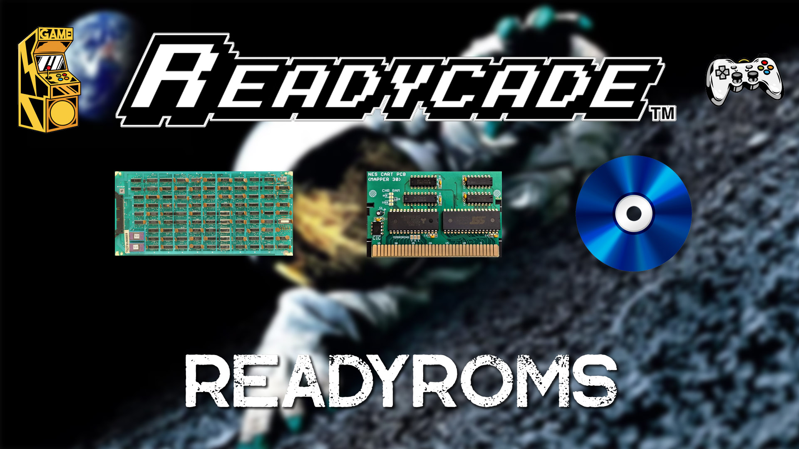

## ReadyRoms
Browse your computer for compatible Rom Packs and we'll do the rest!

## Click the Picture below to Watch the ReadyRomPacks Tutorial
[](https://readycade.com/2023/11/02/readycade-rom-pack-installer-1-0-tutorial/)

## INSTALLATION

### Windows 10/11, Linux and MacOS Supported!

Select a **Rom Pack** from your **computer** and let readyroms.exe do the rest!

eg: n64.zip / n64.7z or snes.zip / snes.7z ect

It puts everything in ALL THE RIGHT PLACES!
```
eg: /recalbox/share/roms/$console_name
```

### Remember to have your Ethernet Cable connected

### Screenshot of ReadyRoms
